#Practice Azure Service Health

----------------------------------------------------------------

 ## Process:
##### -We started session in  [Azure](https://www.portal.azure.com)
##### -in the search engine, we search "Service Health" and click on it.
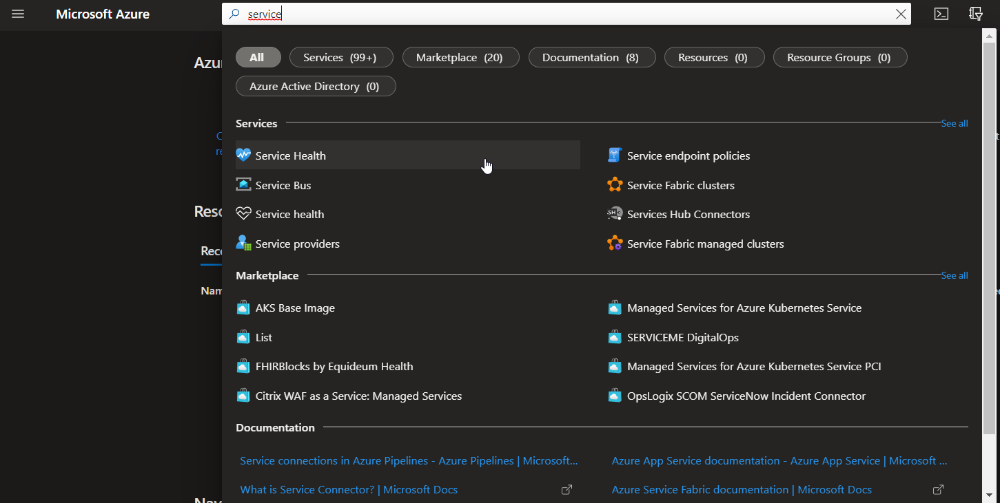
##### -We can see all the map, the type of subscription, regions and services.
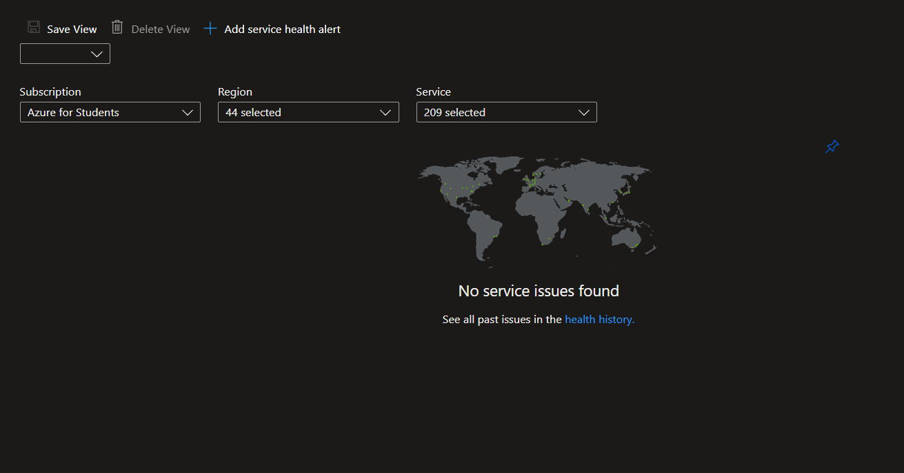
##### -We can create service health alerts, that can send us an alert when a service fails.
##### -Click on create alert.
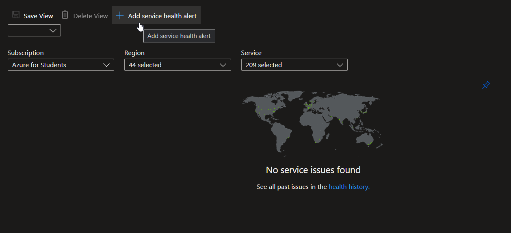
##### -Chose the services in wich you want to create an alert, the regions or an especific region and the type of error we are looking for.
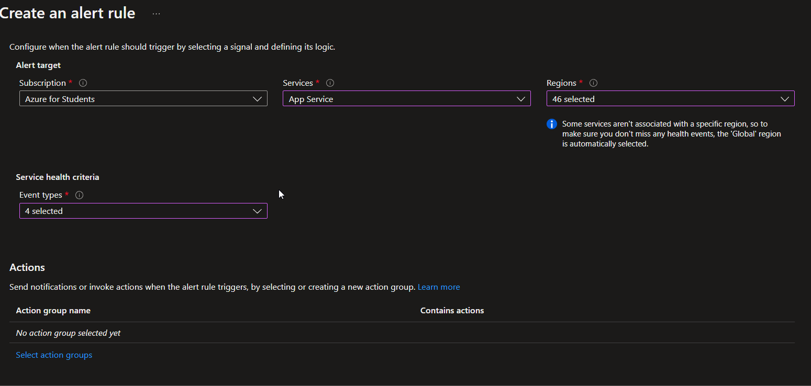
##### -Then, click on select actions groups.
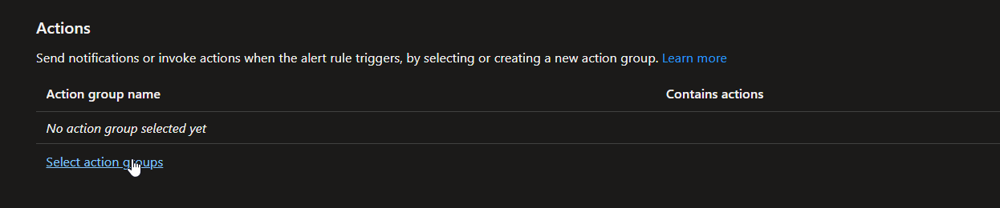
##### -Click on create an action group.
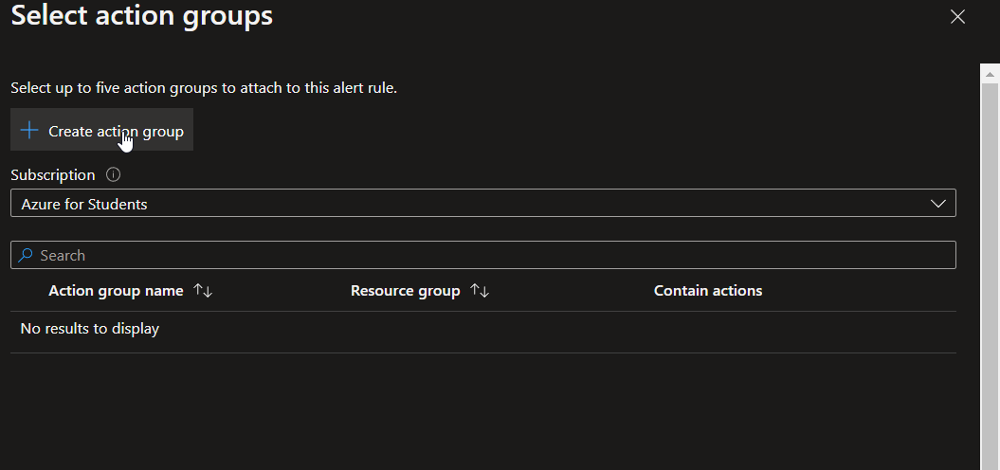
##### -Select the type of subscription, create o select a resource group and set an action name and click on review an create.
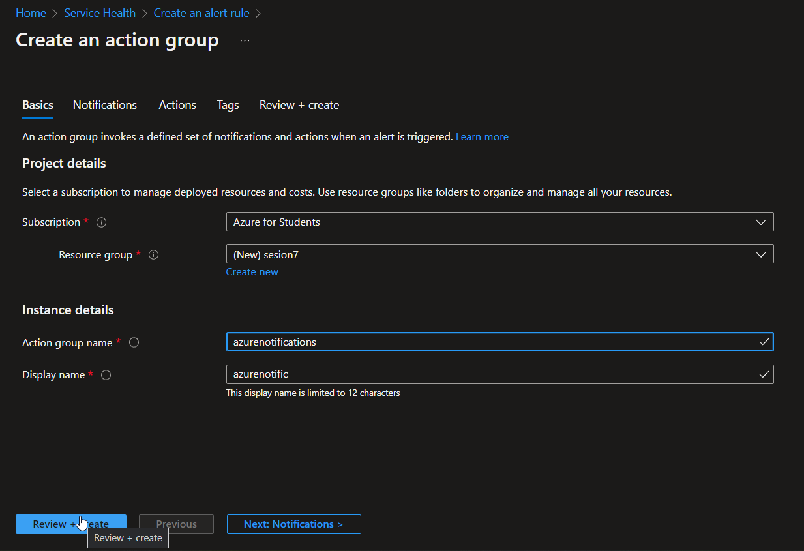
##### -On notification section, select the type of message, set a name, and chose if you want to recive notifications by email or phone click on OK.
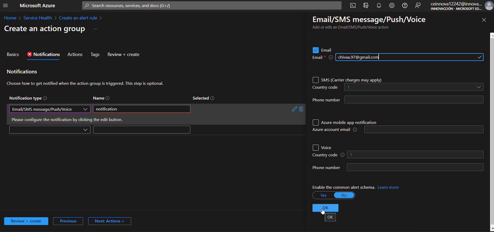
##### -On create and review section, click on test action group.
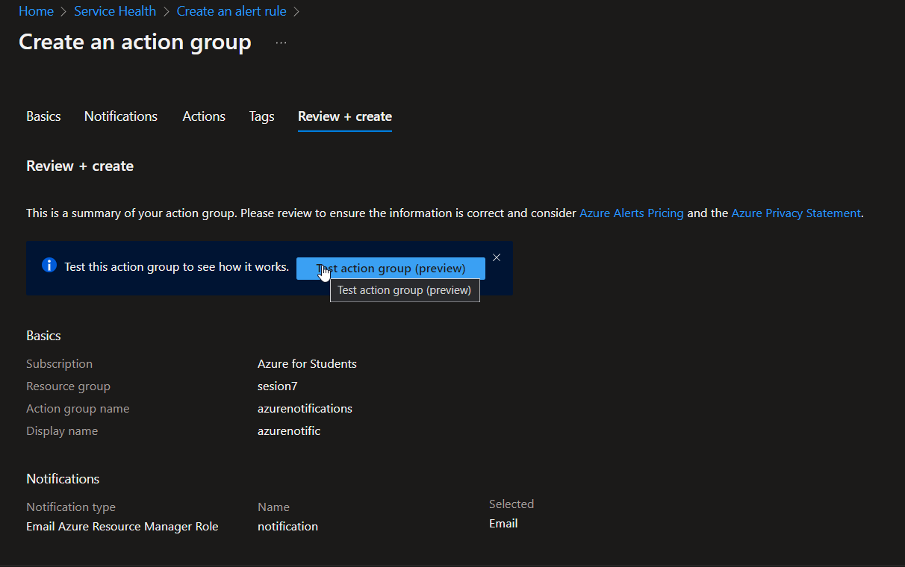
##### -Select sample type.
##### -click on test.
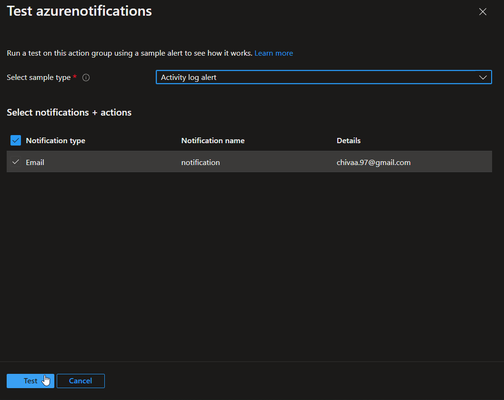
##### -Check your email, you recived an email.
##### -This is how you could recive a notification from azure health service.
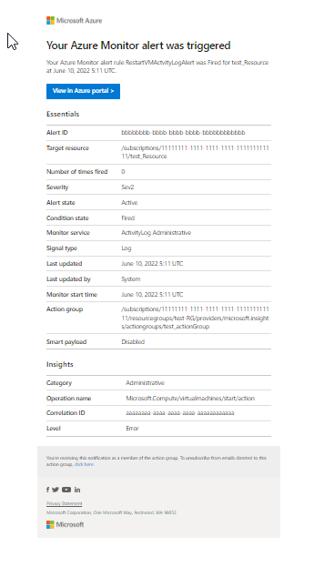
##### -Click on create........
## Congratulations.! you used Azure Service Health.! 🔥🔥